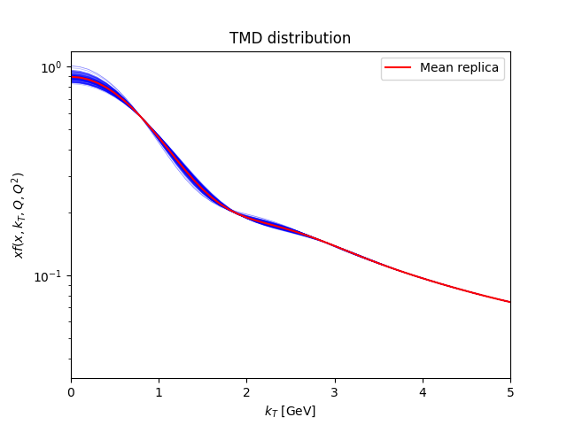
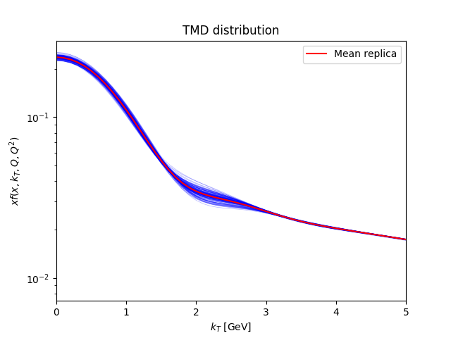
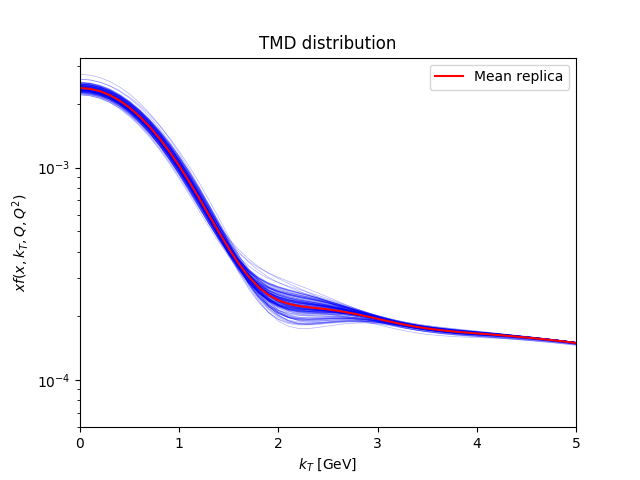

# Report of the fit

## Fit summary

Description: PV19 version x  
Minimiser: minuit  
Random seed: 1234  
Maximum values allowed for $q_T / Q$: 0.2  
Percentile cut: 5  
Parameterisation: PV19x  
Initial parameters fluctuations: False  
Explicit formula:

$$f_{\rm NP}(x,\zeta, b_T)= \Biggl(
\frac{1-\lambda}{1 + g_1(x) b_T^2/4} + \lambda \exp \left(-g_{1B}(x) b_T^2 / 4 \right)\Biggr) \exp\left[- g_2 \log\left(\frac{\zeta}{Q_0^2}\right) b_T^2/4 - g_{2B} \log\left(\frac{\zeta}{Q_0^2}\right) b_T^4/4 \right]$$$$g_1(x) = \frac{N_1}{x\sigma} \exp\left[ - \frac{\ln^2\left(\frac{x}{\alpha}\right)}{2 \sigma^2} \right]$$$$g_{1B}(x) = \frac{N_{1B}}{x\sigma_B} \exp\left[ - \frac{\ln^2\left(\frac{x}{\alpha_B}\right)}{2 \sigma_B^2} \right]$$$$Q_0^2 = 1\;{\rm GeV}^2$$
$t_0$ prescription: True  

|        $g_2$         |       $N_1$       |      $\alpha$      |      $\sigma$      |      $\lambda$      |       $N_{1B}$       |     $\alpha_B$      |      $\sigma_B$       |       $g_{2B}$       |
| :------------------: | :---------------: | :----------------: | :----------------: | :-----------------: | :------------------: | :-----------------: | :-------------------: | :------------------: |
| -0.12171532362505316 | 654.4751907123826 | 140.22949684582787 | 1.8350315259676926 | 0.49862144025369637 | 0.020682804403049194 | 0.17977030257144908 | 0.0034810401323081995 | 0.042248352421387886 |

## Theory summary

Collinear PDF set: MMHT2014nlo68cl member 0  
 Collinear FF set: DSS14_NLO_PiSum member 0  
 $b^*$ prescription: bstarmin  
 Perturbative order: NLLp  
 Reference value of the fine-structure constant: $\alpha(Q = 91.1876\;{\rm GeV}) = 0.00776578395589$ (running True)  

## Global statistical estimators

$N_{rep}$ = 128  
 $\chi_{0}^2$ = 3.2628  
 $\chi_{mean}^2$ = 3.1909  
 $\langle\chi^2\rangle \pm \sigma_{\chi^2}$ = 3.2801 $\pm$ 0.0107  
 $\langle E \rangle \pm \sigma_{E}$ = 4.3175 $\pm$ 0.2259  

## Parameters

| Parameter  | Central replica |        Average over replicas        | Fixed |
| :--------: | :-------------: | :---------------------------------: | :---: |
|   $g_2$    |   -0.12171324   |    -0.12171315 $\pm$ 0.00878992     | False |
|   $N_1$    |    2290.5502    | 22858.55589272 $\pm$ 91979.53431227 | False |
|  $\alpha$  |    417.24014    |  2513.87711699 $\pm$ 8988.48011056  | False |
|  $\sigma$  |    1.9663395    |     1.79482461 $\pm$ 0.30610008     | False |
| $\lambda$  |   0.49454503    |     0.48658755 $\pm$ 0.06344241     | False |
|  $N_{1B}$  |   0.020409603   |     0.02352988 $\pm$ 0.00950689     | False |
| $\alpha_B$ |   0.17977059    |     0.17977411 $\pm$ 6.727e-05      | False |
| $\sigma_B$ |  0.0034851611   |     0.00351953 $\pm$ 0.0005288      | False |
|  $g_{2B}$  |   0.041642355   |     0.04137174 $\pm$ 0.00674311     | False |

## Fit properties

## Table of $\chi^2$'s

Table: Central-replica $\chi^2$'s:

|      Experiment      | Number of points | $\chi_{D}^2$ | $\chi_{\lambda}^2$ | $\chi^2$ |
| :------------------: | :--------------: | :----------: | :----------------: | :------: |
|      E605_Q_7_8      |        7         |    0.4915    |       0.2012       |  0.6927  |
|      E605_Q_8_9      |        8         |    0.914     |       0.0449       |  0.9589  |
|   E605_Q_10.5_11.5   |        10        |    0.5311    |       0.0348       |  0.5659  |
|   E605_Q_11.5_13.5   |        12        |    1.7165    |       0.4008       |  2.1173  |
|    E605_Q_13.5_18    |        13        |    2.4915    |       0.7444       |  3.2359  |
|    E288_200_Q_4_5    |        4         |    1.176     |       0.7007       |  1.8767  |
|    E288_200_Q_5_6    |        5         |    3.1172    |       0.6451       |  3.7622  |
|    E288_200_Q_6_7    |        6         |    1.3511    |       0.2654       |  1.6165  |
|    E288_200_Q_7_8    |        7         |    1.3963    |       0.027        |  1.4233  |
|    E288_200_Q_8_9    |        8         |    0.8052    |       0.0198       |  0.825   |
|    E288_300_Q_4_5    |        4         |    0.9047    |       0.1023       |  1.007   |
|    E288_300_Q_5_6    |        5         |    1.864     |       0.0848       |  1.9488  |
|    E288_300_Q_6_7    |        6         |    1.4965    |       0.0052       |  1.5017  |
|    E288_300_Q_7_8    |        7         |    0.6407    |       0.0163       |  0.657   |
|    E288_300_Q_8_9    |        8         |    0.407     |       0.0298       |  0.4368  |
|   E288_300_Q_11_12   |        9         |    0.3539    |       0.221        |  0.5749  |
|    E288_400_Q_5_6    |        5         |    1.2631    |       0.0047       |  1.2678  |
|    E288_400_Q_6_7    |        6         |    0.7727    |       0.0649       |  0.8377  |
|    E288_400_Q_7_8    |        7         |    0.4782    |       0.0731       |  0.5514  |
|    E288_400_Q_8_9    |        8         |    0.7191    |       0.0638       |  0.7828  |
|   E288_400_Q_11_12   |        11        |    0.5103    |       0.0249       |  0.5352  |
|   E288_400_Q_12_13   |        12        |    0.546     |       0.0286       |  0.5746  |
|   E288_400_Q_13_14   |        12        |    0.4284    |       0.0743       |  0.5027  |
|       STAR_510       |        7         |    1.6267    |       0.0302       |  1.6569  |
|       CDF_RunI       |        25        |    0.8913    |       0.2549       |  1.1461  |
|      CDF_RunII       |        26        |    1.6202    |       0.0317       |  1.6519  |
|       D0_RunI        |        12        |    0.8439    |       0.0094       |  0.8534  |
|       D0_RunII       |        5         |    0.7953    |       0.0081       |  0.8035  |
|      D0_RunIImu      |        3         |    0.9923    |       0.1531       |  1.1454  |
|      LHCb_7TeV       |        7         |     2.19     |       1.4453       |  3.6352  |
|      LHCb_8TeV       |        7         |    2.2627    |       2.6807       |  4.9434  |
|      LHCb_13TeV      |        7         |    1.7916    |       0.5726       |  2.3641  |
|       CMS_7TeV       |        4         |    5.5238    |         0          |  5.5238  |
|       CMS_8TeV       |        4         |    2.3354    |       0.4385       |  2.7738  |
|   ATLAS_7TeV_y_0_1   |        6         |   16.7883    |       4.909        | 21.6973  |
|   ATLAS_7TeV_y_1_2   |        6         |    12.263    |       2.6024       | 14.8654  |
|  ATLAS_7TeV_y_2_2.4  |        6         |    3.4986    |       0.1705       |  3.6692  |
|  ATLAS_8TeV_y_0_0.4  |        6         |   12.5909    |       3.8895       | 16.4804  |
| ATLAS_8TeV_y_0.4_0.8 |        6         |   16.9214    |       6.0062       | 22.9277  |
| ATLAS_8TeV_y_0.8_1.2 |        6         |   11.4388    |       2.219        | 13.6578  |
| ATLAS_8TeV_y_1.2_1.6 |        6         |    7.4139    |       1.7078       |  9.1217  |
|  ATLAS_8TeV_y_1.6_2  |        6         |    6.3556    |       2.2323       |  8.5879  |
|  ATLAS_8TeV_y_2_2.4  |        6         |    2.7285    |       0.7623       |  3.4907  |
|  ATLAS_8TeV_Q_46_66  |        4         |    2.2487    |       0.3708       |  2.6195  |
| ATLAS_8TeV_Q_116_150 |        8         |    3.518     |       0.1115       |  3.6295  |
|        Total         |       353        |      -       |         -          |  3.2628  |

Table: Mean-replica $\chi^2$'s:

|      Experiment      | Number of points | $\chi_{D}^2$ | $\chi_{\lambda}^2$ | $\chi^2$ |
| :------------------: | :--------------: | :----------: | :----------------: | :------: |
|      E605_Q_7_8      |        7         |    0.7147    |       0.1462       |  0.861   |
|      E605_Q_8_9      |        8         |    1.2961    |       0.1067       |  1.4028  |
|   E605_Q_10.5_11.5   |        10        |    0.8116    |       0.0314       |  0.843   |
|   E605_Q_11.5_13.5   |        12        |    1.2568    |       0.226        |  1.4828  |
|    E605_Q_13.5_18    |        13        |    1.2564    |       0.4176       |  1.674   |
|    E288_200_Q_4_5    |        4         |    0.5968    |       0.4821       |  1.0789  |
|    E288_200_Q_5_6    |        5         |    1.7302    |       0.3111       |  2.0414  |
|    E288_200_Q_6_7    |        6         |    0.9751    |       0.2094       |  1.1846  |
|    E288_200_Q_7_8    |        7         |    1.4228    |       0.0513       |  1.4741  |
|    E288_200_Q_8_9    |        8         |    1.1914    |       0.0029       |  1.1943  |
|    E288_300_Q_4_5    |        4         |    0.7052    |       0.1687       |  0.8739  |
|    E288_300_Q_5_6    |        5         |    1.7159    |       0.0648       |  1.7807  |
|    E288_300_Q_6_7    |        6         |    1.7739    |       0.0254       |  1.7994  |
|    E288_300_Q_7_8    |        7         |    0.8713    |       0.0288       |  0.9001  |
|    E288_300_Q_8_9    |        8         |    0.4097    |       0.0357       |  0.4453  |
|   E288_300_Q_11_12   |        9         |    1.0192    |       0.1761       |  1.1952  |
|    E288_400_Q_5_6    |        5         |    1.9475    |       0.0175       |  1.965   |
|    E288_400_Q_6_7    |        6         |    1.8576    |       0.0393       |  1.8969  |
|    E288_400_Q_7_8    |        7         |    1.6375    |       0.0691       |  1.7067  |
|    E288_400_Q_8_9    |        8         |    1.8312    |       0.0732       |  1.9044  |
|   E288_400_Q_11_12   |        11        |    0.7145    |       0.0359       |  0.7504  |
|   E288_400_Q_12_13   |        12        |    0.8322    |       0.0309       |  0.8631  |
|   E288_400_Q_13_14   |        12        |    0.8861    |       0.0708       |  0.9569  |
|       STAR_510       |        7         |    1.3968    |       0.0834       |  1.4801  |
|       CDF_RunI       |        25        |    0.7091    |       0.239        |  0.9481  |
|      CDF_RunII       |        26        |    1.801     |       0.0257       |  1.8267  |
|       D0_RunI        |        12        |    0.7102    |       0.0139       |  0.7241  |
|       D0_RunII       |        5         |    2.312     |       0.0155       |  2.3275  |
|      D0_RunIImu      |        3         |    0.9461    |       0.4472       |  1.3933  |
|      LHCb_7TeV       |        7         |    1.7124    |       1.4107       |  3.1231  |
|      LHCb_8TeV       |        7         |    1.9698    |       2.4908       |  4.4606  |
|      LHCb_13TeV      |        7         |    1.5759    |       0.5103       |  2.0862  |
|       CMS_7TeV       |        4         |    5.3675    |         0          |  5.3675  |
|       CMS_8TeV       |        4         |    2.1951    |       0.4055       |  2.6006  |
|   ATLAS_7TeV_y_0_1   |        6         |   15.7002    |       5.0557       | 20.7559  |
|   ATLAS_7TeV_y_1_2   |        6         |   11.4228    |       2.5715       | 13.9943  |
|  ATLAS_7TeV_y_2_2.4  |        6         |    3.3462    |       0.1722       |  3.5185  |
|  ATLAS_8TeV_y_0_0.4  |        6         |   11.9106    |       3.8812       | 15.7918  |
| ATLAS_8TeV_y_0.4_0.8 |        6         |   16.1788    |       5.9291       | 22.1078  |
| ATLAS_8TeV_y_0.8_1.2 |        6         |   10.9073    |       2.1809       | 13.0882  |
| ATLAS_8TeV_y_1.2_1.6 |        6         |    6.9654    |       1.6974       |  8.6628  |
|  ATLAS_8TeV_y_1.6_2  |        6         |    5.8355    |       2.1127       |  7.9483  |
|  ATLAS_8TeV_y_2_2.4  |        6         |    2.5221    |       0.7408       |  3.263   |
|  ATLAS_8TeV_Q_46_66  |        4         |    1.9766    |       0.3201       |  2.2966  |
| ATLAS_8TeV_Q_116_150 |        8         |    3.3693    |       0.1021       |  3.4714  |
|        Total         |       353        |      -       |         -          |  3.1909  |

Table: Average-over-replicas $\chi^2$'s:

|      Experiment      | Number of points |       $\chi^2$       |
| :------------------: | :--------------: | :------------------: |
|      E605_Q_7_8      |        7         | 0.7069 $\pm$ 0.0904  |
|      E605_Q_8_9      |        8         | 1.0087 $\pm$ 0.0821  |
|   E605_Q_10.5_11.5   |        10        | 0.6035 $\pm$ 0.0836  |
|   E605_Q_11.5_13.5   |        12        | 2.1324 $\pm$ 0.1821  |
|    E605_Q_13.5_18    |        13        | 3.2252 $\pm$ 0.1813  |
|    E288_200_Q_4_5    |        4         | 1.9014 $\pm$ 0.1804  |
|    E288_200_Q_5_6    |        5         | 3.7638 $\pm$ 0.2429  |
|    E288_200_Q_6_7    |        6         | 1.6174 $\pm$ 0.1747  |
|    E288_200_Q_7_8    |        7         | 1.4211 $\pm$ 0.1844  |
|    E288_200_Q_8_9    |        8         | 0.8307 $\pm$ 0.0966  |
|    E288_300_Q_4_5    |        4         | 1.0185 $\pm$ 0.1266  |
|    E288_300_Q_5_6    |        5         |  1.946 $\pm$ 0.2245  |
|    E288_300_Q_6_7    |        6         | 1.4896 $\pm$ 0.2659  |
|    E288_300_Q_7_8    |        7         | 0.6583 $\pm$ 0.1612  |
|    E288_300_Q_8_9    |        8         |  0.451 $\pm$ 0.0321  |
|   E288_300_Q_11_12   |        9         |  0.5843 $\pm$ 0.06   |
|    E288_400_Q_5_6    |        5         | 1.2526 $\pm$ 0.2528  |
|    E288_400_Q_6_7    |        6         | 0.8334 $\pm$ 0.3124  |
|    E288_400_Q_7_8    |        7         | 0.5656 $\pm$ 0.2964  |
|    E288_400_Q_8_9    |        8         | 0.8071 $\pm$ 0.2253  |
|   E288_400_Q_11_12   |        11        | 0.5512 $\pm$ 0.0606  |
|   E288_400_Q_12_13   |        12        | 0.5877 $\pm$ 0.0555  |
|   E288_400_Q_13_14   |        12        |  0.5077 $\pm$ 0.107  |
|       STAR_510       |        7         | 1.6262 $\pm$ 0.1023  |
|       CDF_RunI       |        25        | 1.1498 $\pm$ 0.0355  |
|      CDF_RunII       |        26        | 1.7186 $\pm$ 0.2243  |
|       D0_RunI        |        12        |  0.867 $\pm$ 0.0812  |
|       D0_RunII       |        5         | 0.8379 $\pm$ 0.1708  |
|      D0_RunIImu      |        3         | 1.2009 $\pm$ 0.0877  |
|      LHCb_7TeV       |        7         | 3.6606 $\pm$ 0.1047  |
|      LHCb_8TeV       |        7         | 4.9942 $\pm$ 0.1537  |
|      LHCb_13TeV      |        7         | 2.3875 $\pm$ 0.0464  |
|       CMS_7TeV       |        4         | 5.5227 $\pm$ 0.0585  |
|       CMS_8TeV       |        4         | 2.7751 $\pm$ 0.0843  |
|   ATLAS_7TeV_y_0_1   |        6         | 21.7131 $\pm$ 0.4253 |
|   ATLAS_7TeV_y_1_2   |        6         | 14.9134 $\pm$ 0.3897 |
|  ATLAS_7TeV_y_2_2.4  |        6         |  3.6984 $\pm$ 0.094  |
|  ATLAS_8TeV_y_0_0.4  |        6         | 16.483 $\pm$ 0.2926  |
| ATLAS_8TeV_y_0.4_0.8 |        6         | 22.9654 $\pm$ 0.3531 |
| ATLAS_8TeV_y_0.8_1.2 |        6         | 13.6675 $\pm$ 0.2534 |
| ATLAS_8TeV_y_1.2_1.6 |        6         | 9.1361 $\pm$ 0.1975  |
|  ATLAS_8TeV_y_1.6_2  |        6         | 8.6294 $\pm$ 0.2815  |
|  ATLAS_8TeV_y_2_2.4  |        6         | 3.5283 $\pm$ 0.1425  |
|  ATLAS_8TeV_Q_46_66  |        4         | 2.6154 $\pm$ 0.1052  |
| ATLAS_8TeV_Q_116_150 |        8         | 3.6397 $\pm$ 0.0753  |
|        Total         |       353        | 3.2801 $\pm$ 0.0107  |

## TMDs in $k_T$ space

## Data-theory comparison

