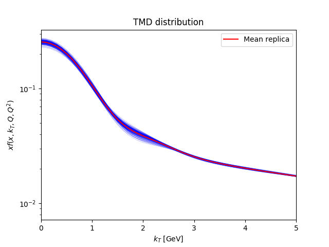
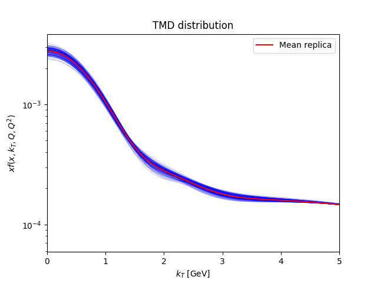

# Report of the fit

## Fit summary

Description: PV19 version x, parameters for NNLL  
Minimiser: ceres  
Random seed: 1234  
Maximum values allowed for $q_T / Q$: 0.2  
Percentile cut: 5  
Parameterisation: PV19x  
Initial parameters fluctuations: True  
Explicit formula:

$$f_{\rm NP}(x,\zeta, b_T)= \Biggl(
\frac{1-\lambda}{1 + g_1(x) b_T^2/4} + \lambda \exp \left(-g_{1B}(x) b_T^2 / 4 \right)\Biggr) \exp\left[- g_2 \log\left(\frac{\zeta}{Q_0^2}\right) b_T^2/4 - g_{2B} \log\left(\frac{\zeta}{Q_0^2}\right) b_T^4/4 \right]$$$$g_1(x) = \frac{N_1}{x\sigma} \exp\left[ - \frac{\ln^2\left(\frac{x}{\alpha}\right)}{2 \sigma^2} \right]$$$$g_{1B}(x) = \frac{N_{1B}}{x\sigma_B} \exp\left[ - \frac{\ln^2\left(\frac{x}{\alpha_B}\right)}{2 \sigma_B^2} \right]$$$$Q_0^2 = 1\;{\rm GeV}^2$$
$t_0$ prescription: True  

|        $g_2$         |       $N_1$        |      $\alpha$      |      $\sigma$      |     $\lambda$      |       $N_{1B}$       |     $\alpha_B$      |     $\sigma_B$     |       $g_{2B}$       |
| :------------------: | :----------------: | :----------------: | :----------------: | :----------------: | :------------------: | :-----------------: | :----------------: | :------------------: |
| -0.05651150850119966 | 1.6027888644000163 | 0.7249039013242403 | 0.9073457205932122 | 0.3543394928378163 | 0.020375939002791388 | 0.09386203899849682 | 0.0274857746762149 | 0.019920085284356754 |

## Theory summary

Collinear PDF set: MMHT2014nlo68cl member 0  
 Collinear FF set: DSS14_NLO_PiSum member 0  
 $b^*$ prescription: bstarmin  
 Perturbative order: NNLL  
 Reference value of the fine-structure constant: $\alpha(Q = 91.1876\;{\rm GeV}) = 0.00776578395589$ (running True)  

## Global statistical estimators

$N_{rep}$ = 123  
 $\chi_{0}^2$ = 1.6686  
 $\chi_{mean}^2$ = 1.6187  
 $\langle\chi^2\rangle \pm \sigma_{\chi^2}$ = 1.699 $\pm$ 0.0179  
 $\langle E \rangle \pm \sigma_{E}$ = 2.7067 $\pm$ 0.1822  

## Parameters

| Parameter  | Central replica |    Average over replicas     | Fixed |
| :--------: | :-------------: | :--------------------------: | :---: |
|   $g_2$    |  -0.057632624   | -0.06067214 $\pm$ 0.00991237 | False |
|   $N_1$    |    2.9759481    |  3.9825571 $\pm$ 2.90529141  | False |
|  $\alpha$  |    1.1506021    | 1.44479698 $\pm$ 0.82949205  | False |
|  $\sigma$  |    1.0075239    | 1.04188758 $\pm$ 0.12926533  | False |
| $\lambda$  |   0.41068867    | 0.38967438 $\pm$ 0.05760985  | False |
|  $N_{1B}$  |   0.020634549   | 0.01698134 $\pm$ 0.02448685  | False |
| $\alpha_B$ |   0.093901444   | 0.08480947 $\pm$ 0.01835043  | False |
| $\sigma_B$ |   0.027372726   | 0.07070338 $\pm$ 0.22613747  | False |
|  $g_{2B}$  |   0.022667287   |  0.0221229 $\pm$ 0.00389806  | False |

## Fit properties

## Table of $\chi^2$'s

Table: Central-replica $\chi^2$'s:

|      Experiment      | Number of points | $\chi_{D}^2$ | $\chi_{\lambda}^2$ | $\chi^2$ |
| :------------------: | :--------------: | :----------: | :----------------: | :------: |
|      E605_Q_7_8      |        7         |    0.6238    |       0.1214       |  0.7452  |
|      E605_Q_8_9      |        8         |    1.3045    |       0.0691       |  1.3736  |
|   E605_Q_10.5_11.5   |        10        |    0.3757    |       0.1109       |  0.4866  |
|   E605_Q_11.5_13.5   |        12        |    0.8441    |       0.5623       |  1.4064  |
|    E605_Q_13.5_18    |        13        |    1.5147    |       0.8465       |  2.3612  |
|    E288_200_Q_4_5    |        4         |    0.7664    |       0.7988       |  1.5652  |
|    E288_200_Q_5_6    |        5         |    2.1307    |       0.4234       |  2.5541  |
|    E288_200_Q_6_7    |        6         |    0.7444    |       0.2812       |  1.0257  |
|    E288_200_Q_7_8    |        7         |    0.8839    |       0.0264       |  0.9103  |
|    E288_200_Q_8_9    |        8         |    0.6539    |       0.0276       |  0.6815  |
|    E288_300_Q_4_5    |        4         |    0.6072    |       0.1654       |  0.7725  |
|    E288_300_Q_5_6    |        5         |    1.1438    |       0.0536       |  1.1973  |
|    E288_300_Q_6_7    |        6         |    0.7982    |       0.0225       |  0.8208  |
|    E288_300_Q_7_8    |        7         |    0.2511    |       0.0364       |  0.2876  |
|    E288_300_Q_8_9    |        8         |    0.4295    |       0.0385       |  0.468   |
|   E288_300_Q_11_12   |        9         |    0.3634    |       0.2529       |  0.6163  |
|    E288_400_Q_5_6    |        5         |    0.5715    |       0.0304       |  0.6019  |
|    E288_400_Q_6_7    |        6         |    0.2342    |       0.0352       |  0.2694  |
|    E288_400_Q_7_8    |        7         |    0.0678    |       0.0442       |  0.112   |
|    E288_400_Q_8_9    |        8         |    0.4449    |       0.0392       |  0.4841  |
|   E288_400_Q_11_12   |        11        |    0.4828    |       0.0234       |  0.5062  |
|   E288_400_Q_12_13   |        12        |    0.5065    |       0.0338       |  0.5403  |
|   E288_400_Q_13_14   |        12        |    0.3174    |       0.0814       |  0.3988  |
|       STAR_510       |        7         |    1.2387    |        0.01        |  1.2486  |
|       CDF_RunI       |        25        |    0.7072    |       0.144        |  0.8512  |
|      CDF_RunII       |        26        |    1.3213    |        0.01        |  1.3313  |
|       D0_RunI        |        12        |    0.7239    |       0.0022       |  0.7262  |
|       D0_RunII       |        5         |    0.7471    |       0.2832       |  1.0303  |
|      D0_RunIImu      |        3         |    0.0917    |       0.0626       |  0.1542  |
|      LHCb_7TeV       |        7         |    1.8719    |        0.84        |  2.7119  |
|      LHCb_8TeV       |        7         |    1.575     |       1.4168       |  2.9918  |
|      LHCb_13TeV      |        7         |    1.3457    |       0.2828       |  1.6285  |
|       CMS_7TeV       |        4         |    2.9143    |         0          |  2.9143  |
|       CMS_8TeV       |        4         |    1.5396    |       0.1872       |  1.7268  |
|   ATLAS_7TeV_y_0_1   |        6         |    7.3245    |       1.0659       |  8.3904  |
|   ATLAS_7TeV_y_1_2   |        6         |    5.305     |       0.4723       |  5.7773  |
|  ATLAS_7TeV_y_2_2.4  |        6         |    1.9714    |       0.0117       |  1.9831  |
|  ATLAS_8TeV_y_0_0.4  |        6         |    5.2343    |       1.0322       |  6.2665  |
| ATLAS_8TeV_y_0.4_0.8 |        6         |    7.0149    |       1.5624       |  8.5772  |
| ATLAS_8TeV_y_0.8_1.2 |        6         |    4.3759    |       0.6204       |  4.9962  |
| ATLAS_8TeV_y_1.2_1.6 |        6         |    2.9863    |       0.386        |  3.3723  |
|  ATLAS_8TeV_y_1.6_2  |        6         |    2.8329    |       0.2559       |  3.0888  |
|  ATLAS_8TeV_y_2_2.4  |        6         |    2.2342    |       0.2927       |  2.5268  |
|  ATLAS_8TeV_Q_46_66  |        4         |    0.8297    |       0.0468       |  0.8764  |
| ATLAS_8TeV_Q_116_150 |        8         |    1.2064    |       0.0081       |  1.2144  |
|        Total         |       353        |      -       |         -          |  1.6686  |

Table: Mean-replica $\chi^2$'s:

|      Experiment      | Number of points | $\chi_{D}^2$ | $\chi_{\lambda}^2$ | $\chi^2$ |
| :------------------: | :--------------: | :----------: | :----------------: | :------: |
|      E605_Q_7_8      |        7         |    1.0413    |       0.1653       |  1.2067  |
|      E605_Q_8_9      |        8         |    1.9883    |       0.0692       |  2.0574  |
|   E605_Q_10.5_11.5   |        10        |    0.289     |       0.1021       |  0.3912  |
|   E605_Q_11.5_13.5   |        12        |    0.4054    |       0.3274       |  0.7328  |
|    E605_Q_13.5_18    |        13        |    0.4925    |       0.4774       |  0.9699  |
|    E288_200_Q_4_5    |        4         |    0.3056    |       0.3168       |  0.6225  |
|    E288_200_Q_5_6    |        5         |    0.9947    |       0.2239       |  1.2186  |
|    E288_200_Q_6_7    |        6         |    0.3204    |       0.1594       |  0.4798  |
|    E288_200_Q_7_8    |        7         |    0.5654    |       0.031        |  0.5963  |
|    E288_200_Q_8_9    |        8         |    0.7568    |       0.0124       |  0.7692  |
|    E288_300_Q_4_5    |        4         |    0.3959    |       0.0655       |  0.4614  |
|    E288_300_Q_5_6    |        5         |    0.7728    |       0.0311       |  0.8039  |
|    E288_300_Q_6_7    |        6         |    0.4961    |       0.0182       |  0.5143  |
|    E288_300_Q_7_8    |        7         |    0.1204    |       0.0309       |  0.1513  |
|    E288_300_Q_8_9    |        8         |    0.3481    |       0.0395       |  0.3876  |
|   E288_300_Q_11_12   |        9         |    1.1611    |       0.1952       |  1.3563  |
|    E288_400_Q_5_6    |        5         |    0.5332    |       0.0536       |  0.5868  |
|    E288_400_Q_6_7    |        6         |    0.1591    |       0.0472       |  0.2063  |
|    E288_400_Q_7_8    |        7         |    0.0282    |       0.0521       |  0.0803  |
|    E288_400_Q_8_9    |        8         |    0.571     |       0.038        |  0.6091  |
|   E288_400_Q_11_12   |        11        |    0.6297    |       0.0147       |  0.6445  |
|   E288_400_Q_12_13   |        12        |    0.705     |       0.0203       |  0.7253  |
|   E288_400_Q_13_14   |        12        |    0.5264    |       0.0758       |  0.6022  |
|       STAR_510       |        7         |    1.0982    |       0.033        |  1.1312  |
|       CDF_RunI       |        25        |    0.5492    |       0.1396       |  0.6888  |
|      CDF_RunII       |        26        |    1.277     |       0.0054       |  1.2824  |
|       D0_RunI        |        12        |    0.7523    |       0.0008       |  0.7531  |
|       D0_RunII       |        5         |    0.6181    |       0.2753       |  0.8934  |
|      D0_RunIImu      |        3         |    0.1504    |       0.0802       |  0.2306  |
|      LHCb_7TeV       |        7         |    1.7073    |       0.8373       |  2.5446  |
|      LHCb_8TeV       |        7         |    1.6073    |       1.3343       |  2.9416  |
|      LHCb_13TeV      |        7         |    1.2351    |       0.2661       |  1.5012  |
|       CMS_7TeV       |        4         |    2.9437    |         0          |  2.9437  |
|       CMS_8TeV       |        4         |    1.6294    |       0.2037       |  1.8331  |
|   ATLAS_7TeV_y_0_1   |        6         |    7.8261    |       1.0375       |  8.8636  |
|   ATLAS_7TeV_y_1_2   |        6         |    5.4844    |       0.4931       |  5.9775  |
|  ATLAS_7TeV_y_2_2.4  |        6         |    2.2383    |       0.0132       |  2.2515  |
|  ATLAS_8TeV_y_0_0.4  |        6         |    5.6345    |       1.0816       |  6.7161  |
| ATLAS_8TeV_y_0.4_0.8 |        6         |    7.1082    |       1.6795       |  8.7877  |
| ATLAS_8TeV_y_0.8_1.2 |        6         |    4.5226    |       0.6608       |  5.1834  |
| ATLAS_8TeV_y_1.2_1.6 |        6         |    3.0431    |       0.4013       |  3.4444  |
|  ATLAS_8TeV_y_1.6_2  |        6         |    2.8589    |       0.2841       |  3.143   |
|  ATLAS_8TeV_y_2_2.4  |        6         |    3.0846    |       0.3833       |  3.4678  |
|  ATLAS_8TeV_Q_46_66  |        4         |    0.832     |       0.0766       |  0.9087  |
| ATLAS_8TeV_Q_116_150 |        8         |    1.2569    |       0.0044       |  1.2614  |
|        Total         |       353        |      -       |         -          |  1.6187  |

Table: Average-over-replicas $\chi^2$'s:

|      Experiment      | Number of points |      $\chi^2$       |
| :------------------: | :--------------: | :-----------------: |
|      E605_Q_7_8      |        7         | 0.7432 $\pm$ 0.1616 |
|      E605_Q_8_9      |        8         | 1.4255 $\pm$ 0.2666 |
|   E605_Q_10.5_11.5   |        10        | 0.5176 $\pm$ 0.0553 |
|   E605_Q_11.5_13.5   |        12        | 1.4606 $\pm$ 0.1141 |
|    E605_Q_13.5_18    |        13        | 2.3576 $\pm$ 0.1744 |
|    E288_200_Q_4_5    |        4         | 1.6882 $\pm$ 0.2984 |
|    E288_200_Q_5_6    |        5         | 2.5667 $\pm$ 0.2263 |
|    E288_200_Q_6_7    |        6         | 1.0203 $\pm$ 0.1495 |
|    E288_200_Q_7_8    |        7         | 0.881 $\pm$ 0.1447  |
|    E288_200_Q_8_9    |        8         | 0.6676 $\pm$ 0.0623 |
|    E288_300_Q_4_5    |        4         | 0.8535 $\pm$ 0.1861 |
|    E288_300_Q_5_6    |        5         | 1.2042 $\pm$ 0.1686 |
|    E288_300_Q_6_7    |        6         | 0.7994 $\pm$ 0.1787 |
|    E288_300_Q_7_8    |        7         | 0.2826 $\pm$ 0.0889 |
|    E288_300_Q_8_9    |        8         | 0.4933 $\pm$ 0.0435 |
|   E288_300_Q_11_12   |        9         | 0.6226 $\pm$ 0.074  |
|    E288_400_Q_5_6    |        5         | 0.5998 $\pm$ 0.1633 |
|    E288_400_Q_6_7    |        6         | 0.2682 $\pm$ 0.1374 |
|    E288_400_Q_7_8    |        7         | 0.1264 $\pm$ 0.0959 |
|    E288_400_Q_8_9    |        8         | 0.5005 $\pm$ 0.0706 |
|   E288_400_Q_11_12   |        11        | 0.5285 $\pm$ 0.0732 |
|   E288_400_Q_12_13   |        12        | 0.5632 $\pm$ 0.0512 |
|   E288_400_Q_13_14   |        12        | 0.3997 $\pm$ 0.0756 |
|       STAR_510       |        7         | 1.2353 $\pm$ 0.0904 |
|       CDF_RunI       |        25        | 0.8573 $\pm$ 0.0399 |
|      CDF_RunII       |        26        | 1.4921 $\pm$ 0.217  |
|       D0_RunI        |        12        | 0.7562 $\pm$ 0.0507 |
|       D0_RunII       |        5         | 1.2175 $\pm$ 0.3092 |
|      D0_RunIImu      |        3         | 0.2007 $\pm$ 0.1525 |
|      LHCb_7TeV       |        7         | 2.722 $\pm$ 0.0744  |
|      LHCb_8TeV       |        7         | 3.0174 $\pm$ 0.1745 |
|      LHCb_13TeV      |        7         | 1.6371 $\pm$ 0.0402 |
|       CMS_7TeV       |        4         | 2.921 $\pm$ 0.0166  |
|       CMS_8TeV       |        4         | 1.7485 $\pm$ 0.0684 |
|   ATLAS_7TeV_y_0_1   |        6         | 8.4585 $\pm$ 0.2608 |
|   ATLAS_7TeV_y_1_2   |        6         | 5.8815 $\pm$ 0.1855 |
|  ATLAS_7TeV_y_2_2.4  |        6         | 1.9866 $\pm$ 0.1213 |
|  ATLAS_8TeV_y_0_0.4  |        6         | 6.2521 $\pm$ 0.2219 |
| ATLAS_8TeV_y_0.4_0.8 |        6         | 8.6274 $\pm$ 0.1297 |
| ATLAS_8TeV_y_0.8_1.2 |        6         |  5.0667 $\pm$ 0.15  |
| ATLAS_8TeV_y_1.2_1.6 |        6         | 3.4761 $\pm$ 0.1573 |
|  ATLAS_8TeV_y_1.6_2  |        6         | 3.2569 $\pm$ 0.2928 |
|  ATLAS_8TeV_y_2_2.4  |        6         | 2.2757 $\pm$ 0.4488 |
|  ATLAS_8TeV_Q_46_66  |        4         | 0.8699 $\pm$ 0.0244 |
| ATLAS_8TeV_Q_116_150 |        8         | 1.2264 $\pm$ 0.0262 |
|        Total         |       353        | 1.699 $\pm$ 0.0179  |

## TMDs in $k_T$ space

## Data-theory comparison

