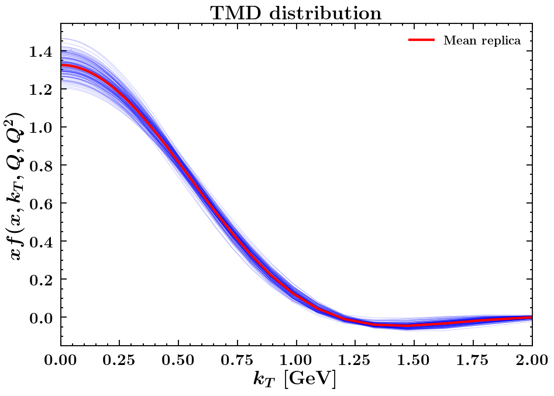

# Report of the fit

## Fit summary

Description: PV19 version x  
Minimiser: minuit  
Random seed: 1234  
Maximum values allowed for $q_T / Q$: 0.2  
Percentile cut: 5  
Parameterisation: PV19x  
Initial parameters fluctuations: True  
Explicit formula:

$$f_{\rm NP}(x,\zeta, b_T)= \Biggl(
\frac{1-\lambda}{1 + g_1(x) b_T^2/4} + \lambda \exp \left(-g_{1B}(x) b_T^2 / 4 \right)\Biggr) \exp\left[- g_2 \log\left(\frac{\zeta}{Q_0^2}\right) b_T^2/4 - g_{2B} \log\left(\frac{\zeta}{Q_0^2}\right) b_T^4/4 \right]$$$$g_1(x) = \frac{N_1}{x\sigma} \exp\left[ - \frac{\ln^2\left(\frac{x}{\alpha}\right)}{2 \sigma^2} \right]$$$$g_{1B}(x) = \frac{N_{1B}}{x\sigma_B} \exp\left[ - \frac{\ln^2\left(\frac{x}{\alpha_B}\right)}{2 \sigma_B^2} \right]$$$$Q_0^2 = 1\;{\rm GeV}^2$$
$t_0$ prescription: True  

|         $g_2$         |        $N_1$        |      $\alpha$       |      $\sigma$      |     $\lambda$     |      $N_{1B}$       |     $\alpha_B$      |     $\sigma_B$     |       $g_{2B}$       |
| :-------------------: | :-----------------: | :-----------------: | :----------------: | :---------------: | :-----------------: | :-----------------: | :----------------: | :------------------: |
| 0.0010419173824142214 | 0.39014293364681746 | 0.22161484622320993 | 0.4074774248933806 | 0.526353557609152 | 0.03814065059347773 | 0.07312140408143371 | 0.3351975265330307 | 0.014297981212139585 |

## Theory summary

Collinear PDF set: MMHT2014nnlo68cl member 0  
 Collinear FF set: DSS14_NLO_PiSum member 0  
 $b^*$ prescription: bstarmin  
 Perturbative order: NNLLp  
 Reference value of the fine-structure constant: $\alpha(Q = 91.1876\;{\rm GeV}) = 0.00776578395589$ (running True)  

## Global statistical estimators

$N_{rep}$ = 122  
 $\chi_{0}^2$ = 1.1465  
 $\chi_{mean}^2$ = 1.0724  
 $\langle\chi^2\rangle \pm \sigma_{\chi^2}$ = 1.1698 $\pm$ 0.0124  
 $\langle E \rangle \pm \sigma_{E}$ = 2.1819 $\pm$ 0.1528  

## Parameters

| Parameter  | Central replica |    Average over replicas     | Fixed |
| :--------: | :-------------: | :--------------------------: | :---: |
|   $g_2$    |  0.00011560729  | -0.00104242 $\pm$ 0.00810468 | False |
|   $N_1$    |   0.42030542    | 0.44676858 $\pm$ 0.14107231  | False |
|  $\alpha$  |   0.21950611    | 0.22573654 $\pm$ 0.01364442  | False |
|  $\sigma$  |   0.39278937    | 0.39114982 $\pm$ 0.08850198  | False |
| $\lambda$  |   0.55456343    |  0.54421056 $\pm$ 0.0871428  | False |
|  $N_{1B}$  |   0.037791147   | 0.04211653 $\pm$ 0.01288901  | False |
| $\alpha_B$ |   0.073482989   | 0.07526806 $\pm$ 0.01089862  | False |
| $\sigma_B$ |   0.33712526    | 0.30370251 $\pm$ 0.11145638  | False |
|  $g_{2B}$  |   0.015197922   | 0.01507184 $\pm$ 0.00297575  | False |

## Fit properties

## Table of $\chi^2$'s

Table: Central-replica $\chi^2$'s:

|      Experiment      | Number of points | $\chi_{D}^2$ | $\chi_{\lambda}^2$ | $\chi^2$ |
| :------------------: | :--------------: | :----------: | :----------------: | :------: |
|      E605_Q_7_8      |        7         |    0.611     |       0.001        |  0.612   |
|      E605_Q_8_9      |        8         |    1.419     |       0.001        |  1.419   |
|   E605_Q_10.5_11.5   |        10        |     0.36     |       0.188        |  0.548   |
|   E605_Q_11.5_13.5   |        12        |    0.834     |        0.56        |  1.394   |
|    E605_Q_13.5_18    |        13        |    1.404     |       0.705        |   2.11   |
|    E288_200_Q_4_5    |        4         |    0.648     |        0.9         |  1.549   |
|    E288_200_Q_5_6    |        5         |    1.578     |       0.298        |  1.876   |
|    E288_200_Q_6_7    |        6         |    0.335     |       0.148        |  0.482   |
|    E288_200_Q_7_8    |        7         |    0.449     |       0.006        |  0.455   |
|    E288_200_Q_8_9    |        8         |    0.552     |       0.041        |  0.593   |
|    E288_300_Q_4_5    |        4         |    0.545     |       0.529        |  1.074   |
|    E288_300_Q_5_6    |        5         |    0.877     |       0.151        |  1.029   |
|    E288_300_Q_6_7    |        6         |    0.509     |       0.038        |  0.547   |
|    E288_300_Q_7_8    |        7         |    0.115     |       0.021        |  0.136   |
|    E288_300_Q_8_9    |        8         |    0.521     |       0.008        |  0.529   |
|   E288_300_Q_11_12   |        9         |    0.356     |       0.233        |  0.589   |
|    E288_400_Q_5_6    |        5         |    0.347     |       0.004        |  0.351   |
|    E288_400_Q_6_7    |        6         |    0.096     |       0.001        |  0.097   |
|    E288_400_Q_7_8    |        7         |    0.019     |        0.02        |  0.039   |
|    E288_400_Q_8_9    |        8         |    0.427     |        0.04        |  0.466   |
|   E288_400_Q_11_12   |        11        |    0.495     |       0.041        |  0.536   |
|   E288_400_Q_12_13   |        12        |    0.487     |       0.039        |  0.526   |
|   E288_400_Q_13_14   |        12        |    0.596     |       0.085        |   0.68   |
|       STAR_510       |        7         |    0.952     |        0.04        |  0.992   |
|       CDF_RunI       |        25        |    0.555     |       0.072        |  0.627   |
|      CDF_RunII       |        26        |    0.948     |       0.002        |   0.95   |
|       D0_RunI        |        12        |    0.645     |       0.032        |  0.677   |
|       D0_RunII       |        5         |     1.05     |       0.046        |  1.096   |
|      D0_RunIImu      |        3         |    0.295     |        0.05        |  0.345   |
|      LHCb_7TeV       |        7         |    1.191     |       0.205        |  1.396   |
|      LHCb_8TeV       |        7         |    0.546     |       0.155        |  0.701   |
|      LHCb_13TeV      |        7         |    0.817     |        0.04        |  0.857   |
|       CMS_7TeV       |        4         |    2.532     |         0          |  2.532   |
|       CMS_8TeV       |        4         |    1.319     |       0.156        |  1.475   |
|   ATLAS_7TeV_y_0_1   |        6         |    3.519     |       0.017        |  3.536   |
|   ATLAS_7TeV_y_1_2   |        6         |    3.691     |       0.597        |  4.288   |
|  ATLAS_7TeV_y_2_2.4  |        6         |    2.907     |       0.286        |  3.193   |
|  ATLAS_8TeV_y_0_0.4  |        6         |    3.095     |       0.718        |  3.812   |
| ATLAS_8TeV_y_0.4_0.8 |        6         |    3.424     |       0.702        |  4.126   |
| ATLAS_8TeV_y_0.8_1.2 |        6         |    1.601     |       0.181        |  1.782   |
| ATLAS_8TeV_y_1.2_1.6 |        6         |    1.381     |       0.228        |  1.609   |
|  ATLAS_8TeV_y_1.6_2  |        6         |    0.926     |       0.289        |  1.214   |
|  ATLAS_8TeV_y_2_2.4  |        6         |     0.95     |       0.432        |  1.382   |
|  ATLAS_8TeV_Q_46_66  |        4         |    1.853     |       0.531        |  2.384   |
| ATLAS_8TeV_Q_116_150 |        8         |    0.657     |       0.002        |   0.66   |
|        Total         |       353        |    0.973     |       0.173        |  1.146   |

Table: Mean-replica $\chi^2$'s:

|      Experiment      | Number of points | $\chi_{D}^2$ | $\chi_{\lambda}^2$ | $\chi^2$ |
| :------------------: | :--------------: | :----------: | :----------------: | :------: |
|      E605_Q_7_8      |        7         |    0.425     |       0.048        |  0.472   |
|      E605_Q_8_9      |        8         |    0.991     |       0.027        |  1.018   |
|   E605_Q_10.5_11.5   |        10        |    0.183     |       0.156        |  0.339   |
|   E605_Q_11.5_13.5   |        12        |    0.442     |       0.318        |  0.759   |
|    E605_Q_13.5_18    |        13        |    0.463     |       0.423        |  0.886   |
|    E288_200_Q_4_5    |        4         |    0.252     |       0.659        |  0.911   |
|    E288_200_Q_5_6    |        5         |    0.762     |       0.308        |   1.07   |
|    E288_200_Q_6_7    |        6         |    0.174     |       0.156        |   0.33   |
|    E288_200_Q_7_8    |        7         |    0.303     |       0.019        |  0.322   |
|    E288_200_Q_8_9    |        8         |    0.652     |       0.018        |  0.669   |
|    E288_300_Q_4_5    |        4         |    0.268     |       0.528        |  0.796   |
|    E288_300_Q_5_6    |        5         |     0.57     |       0.203        |  0.773   |
|    E288_300_Q_6_7    |        6         |    0.384     |        0.07        |  0.455   |
|    E288_300_Q_7_8    |        7         |    0.076     |        0.04        |  0.116   |
|    E288_300_Q_8_9    |        8         |    0.458     |       0.026        |  0.484   |
|   E288_300_Q_11_12   |        9         |    0.977     |       0.146        |  1.123   |
|    E288_400_Q_5_6    |        5         |     0.39     |       0.053        |  0.443   |
|    E288_400_Q_6_7    |        6         |    0.136     |       0.004        |  0.141   |
|    E288_400_Q_7_8    |        7         |    0.023     |       0.008        |  0.031   |
|    E288_400_Q_8_9    |        8         |    0.438     |       0.027        |  0.465   |
|   E288_400_Q_11_12   |        11        |    0.585     |       0.023        |  0.608   |
|   E288_400_Q_12_13   |        12        |     0.73     |       0.018        |  0.748   |
|   E288_400_Q_13_14   |        12        |    1.039     |       0.034        |  1.073   |
|       STAR_510       |        7         |    0.798     |       0.065        |  0.863   |
|       CDF_RunI       |        25        |    0.489     |       0.073        |  0.562   |
|      CDF_RunII       |        26        |    1.034     |        0.0         |  1.034   |
|       D0_RunI        |        12        |    0.722     |       0.028        |   0.75   |
|       D0_RunII       |        5         |    1.051     |       0.046        |  1.097   |
|      D0_RunIImu      |        3         |    0.379     |        0.08        |  0.459   |
|      LHCb_7TeV       |        7         |    1.096     |       0.235        |  1.331   |
|      LHCb_8TeV       |        7         |    0.492     |       0.148        |   0.64   |
|      LHCb_13TeV      |        7         |    0.759     |       0.038        |  0.797   |
|       CMS_7TeV       |        4         |    2.528     |         0          |  2.528   |
|       CMS_8TeV       |        4         |    1.301     |       0.153        |  1.454   |
|   ATLAS_7TeV_y_0_1   |        6         |    3.403     |       0.019        |  3.422   |
|   ATLAS_7TeV_y_1_2   |        6         |    3.798     |       0.596        |  4.394   |
|  ATLAS_7TeV_y_2_2.4  |        6         |    2.984     |       0.282        |  3.266   |
|  ATLAS_8TeV_y_0_0.4  |        6         |    2.999     |       0.699        |  3.698   |
| ATLAS_8TeV_y_0.4_0.8 |        6         |    3.544     |       0.665        |  4.209   |
| ATLAS_8TeV_y_0.8_1.2 |        6         |     1.62     |       0.174        |  1.794   |
| ATLAS_8TeV_y_1.2_1.6 |        6         |    1.395     |       0.222        |  1.617   |
|  ATLAS_8TeV_y_1.6_2  |        6         |     0.99     |       0.296        |  1.287   |
|  ATLAS_8TeV_y_2_2.4  |        6         |    1.126     |       0.485        |  1.611   |
|  ATLAS_8TeV_Q_46_66  |        4         |     1.71     |       0.567        |  2.277   |
| ATLAS_8TeV_Q_116_150 |        8         |     0.67     |       0.002        |  0.672   |
|        Total         |       353        |    0.922     |       0.151        |  1.072   |

Table: Average-over-replicas $\chi^2$'s:

|      Experiment      | Number of points |     $\chi^2$      |
| :------------------: | :--------------: | :---------------: |
|      E605_Q_7_8      |        7         | 0.683 $\pm$ 0.155 |
|      E605_Q_8_9      |        8         | 1.482 $\pm$ 0.226 |
|   E605_Q_10.5_11.5   |        10        | 0.584 $\pm$ 0.072 |
|   E605_Q_11.5_13.5   |        12        | 1.477 $\pm$ 0.096 |
|    E605_Q_13.5_18    |        13        | 2.118 $\pm$ 0.097 |
|    E288_200_Q_4_5    |        4         | 1.516 $\pm$ 0.339 |
|    E288_200_Q_5_6    |        5         | 1.858 $\pm$ 0.201 |
|    E288_200_Q_6_7    |        6         | 0.479 $\pm$ 0.091 |
|    E288_200_Q_7_8    |        7         | 0.447 $\pm$ 0.131 |
|    E288_200_Q_8_9    |        8         | 0.593 $\pm$ 0.058 |
|    E288_300_Q_4_5    |        4         | 1.062 $\pm$ 0.289 |
|    E288_300_Q_5_6    |        5         | 1.034 $\pm$ 0.142 |
|    E288_300_Q_6_7    |        6         | 0.542 $\pm$ 0.127 |
|    E288_300_Q_7_8    |        7         | 0.138 $\pm$ 0.047 |
|    E288_300_Q_8_9    |        8         | 0.561 $\pm$ 0.085 |
|   E288_300_Q_11_12   |        9         | 0.594 $\pm$ 0.03  |
|    E288_400_Q_5_6    |        5         | 0.38 $\pm$ 0.102  |
|    E288_400_Q_6_7    |        6         | 0.121 $\pm$ 0.046 |
|    E288_400_Q_7_8    |        7         | 0.07 $\pm$ 0.044  |
|    E288_400_Q_8_9    |        8         | 0.501 $\pm$ 0.074 |
|   E288_400_Q_11_12   |        11        | 0.593 $\pm$ 0.137 |
|   E288_400_Q_12_13   |        12        | 0.55 $\pm$ 0.035  |
|   E288_400_Q_13_14   |        12        | 0.68 $\pm$ 0.055  |
|       STAR_510       |        7         | 1.009 $\pm$ 0.071 |
|       CDF_RunI       |        25        | 0.629 $\pm$ 0.019 |
|      CDF_RunII       |        26        | 0.977 $\pm$ 0.084 |
|       D0_RunI        |        12        | 0.688 $\pm$ 0.026 |
|       D0_RunII       |        5         | 1.041 $\pm$ 0.218 |
|      D0_RunIImu      |        3         | 0.394 $\pm$ 0.174 |
|      LHCb_7TeV       |        7         |  1.4 $\pm$ 0.027  |
|      LHCb_8TeV       |        7         | 0.713 $\pm$ 0.091 |
|      LHCb_13TeV      |        7         | 0.88 $\pm$ 0.045  |
|       CMS_7TeV       |        4         | 2.535 $\pm$ 0.014 |
|       CMS_8TeV       |        4         | 1.472 $\pm$ 0.06  |
|   ATLAS_7TeV_y_0_1   |        6         | 3.57 $\pm$ 0.282  |
|   ATLAS_7TeV_y_1_2   |        6         | 4.366 $\pm$ 0.117 |
|  ATLAS_7TeV_y_2_2.4  |        6         | 3.232 $\pm$ 0.092 |
|  ATLAS_8TeV_y_0_0.4  |        6         | 3.814 $\pm$ 0.178 |
| ATLAS_8TeV_y_0.4_0.8 |        6         | 4.162 $\pm$ 0.077 |
| ATLAS_8TeV_y_0.8_1.2 |        6         | 1.815 $\pm$ 0.079 |
| ATLAS_8TeV_y_1.2_1.6 |        6         | 1.647 $\pm$ 0.117 |
|  ATLAS_8TeV_y_1.6_2  |        6         | 1.288 $\pm$ 0.208 |
|  ATLAS_8TeV_y_2_2.4  |        6         | 1.537 $\pm$ 0.382 |
|  ATLAS_8TeV_Q_46_66  |        4         | 2.376 $\pm$ 0.108 |
| ATLAS_8TeV_Q_116_150 |        8         | 0.666 $\pm$ 0.014 |
|        Total         |       353        | 1.17 $\pm$ 0.012  |

## TMDs in $k_T$ space

## Data-theory comparison

