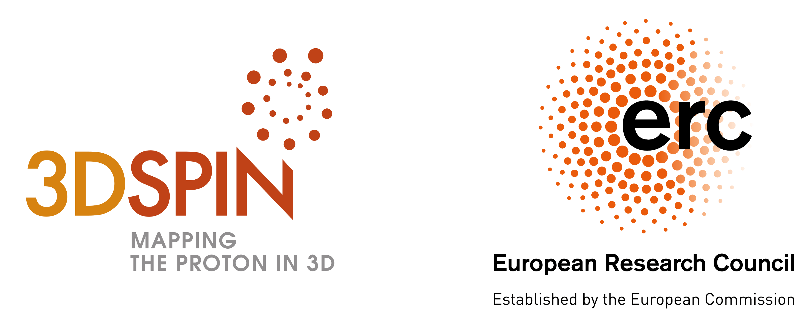

# Nanga Parbat: a TMD fitting framework

Nanga Parbat is a fitting framework aimed at the determination of the
non-perturbative component of TMD distributions.

## Download

You can obtain NangaParbat directly from the github repository:

https://github.com/vbertone/NangaParbat/releases

For the last development branch you can clone the master code:

```Shell
git clone git@github.com:vbertone/NangaParbat.git
```

If you instead want to download a specific tag:

```Shell
git tag -l
git checkout tags/tag_name
```
## Dependencies

In order to install the code a number of external but relatively standard libraries are required. Here is the list:
- [``yaml-cpp``](https://github.com/jbeder/yaml-cpp),
- [``eigen3``](https://eigen.tuxfamily.org/dox/),
- [``ceres-solver``](http://ceres-solver.org),
- [``GSL``](https://www.gnu.org/software/gsl/doc/html/),
- [``ROOT``](https://root.cern.ch) with ``Minuit2``,
- [``LHAPDF6``](https://lhapdf.hepforge.org),
- [``APFEL++``](https://github.com/vbertone/apfelxx).

Most of these libraries can be installed through standard package managers such as [``Homebrew``](https://brew.sh) on MacOS and ``apt-get`` on Linux.

NangaParbat also has a __lite version__, that does not require all the dependencies listed above. The mandatory dependencies are ``yaml-cpp``, ``eigen3``, ``LHAPDF6``, ``APFEL++``. 

During the installation, NangaParbat detects if one or more libraries among ``GSL``, ``ROOT`` or ``ceres-solver`` are missing and installs and compiles only the part of the code that is possible to run.


## Installation 

The code can be compiled using the following procedure:

```Shell
cd NangaParbat
cmake -DCMAKE_INSTALL_PREFIX=/your/installation/path/ .
make && make install
```
By the default, if no prefix specification is given, the program will
be installed in the /usr/local folder. If you want (or need) to use a
different path, remember to export the NangaParbat /lib folder into the
LD_LIBRARY_PATH. More configuration options can be accessed by typing:

```Shell
ccmake .
```

## Running the code

Despite the core of the code is written in ``C++``, the main functionalities can be accessed through the [command-line-interface](doc/CommandLineInterface.md) utilities. If the installation was successful, it is possible to run a fit of TMD PDFs just by typing from the main folder:
```Shell
python3 cli/fit.py
```
and following the instructions. Any such fit relies on the dataset, the interpolation tables, and the TMD parameterisations currently present in the code. It is however possible to generate new interpolation tables using the ``cli/tables.py`` utility that gives the possibility change the theory settings (perturbative order, collinear PDF set, etc.). Including more parameterisations and new experimental datasets is also possible but requires some additional work on the core of the code. Feel free to contact us should you want to extend the code in this respect.

Once the fit is complete (including a number of Monte Carlo replicas), it is possible to create a summary report of the fit by running ``cli/report.py``. This will create a document (in markdown and html format) that collects the main statistical features of the fit, histograms, data-theory comparison plots, and TMD plots.

## Documentation

Some further general documentation can be found at the following links:

- [command line interface](doc/CommandLineInterface.md)
- [utilities](run/)
- [raw data files](rawdata/)
- [preprocessed data files](data/)
- [convolution prefactors](doc/ConvTablesPrefactors.md)

Code documentation generated with Doxygen can be found [here](https://vbertone.github.io/NangaParbat/html/index.html).

## Public results

The results obtained with NangaParbat for the fit of TMD PDFs to Drell-Yan data can be found at the following links:

- fit at [N3LL](https://vbertone.github.io/NangaParbat/results/PV19/N3LL/index.html),
- fit at [NNLL'](https://vbertone.github.io/NangaParbat/results/PV19/NNLLp/index.html),
- fit at [NNLL](https://vbertone.github.io/NangaParbat/results/PV19/NNLL/index.html),
- fit at [NLL'](https://vbertone.github.io/NangaParbat/results/PV19/NLLp/index.html).

The reports above have been generated using the CLI ``cli/report.py``.

## TMD grids

Below you can find a list of TMD and structure functions grids that
are compatible with NangaParbat specifications and can be used with
the Nanga Parbat interpolation routines. The grids will be made
available also through the TMDlib library.

- PV17 fit [Reference: [arXiv:1703.10157](https://arxiv.org/pdf/1703.10157.pdf)]: here https://drive.google.com/drive/folders/1cXHZKS0OmY7woUBR2zw_Nf6RmAQYimjl?usp=sharing you can find the grids of the TMD PDFs and FFs, and the SIDIS F_UUT structure functions

## Use of TMD grids

In ``tools/`` there are some test codes that can be run by the user in
order to interpolate the TMD and structure function grids provided at
the link above. This part of NangaParbat is compiled also in the lite
version.

The interpolation of the grids can be done with
``TMDGridInterpolation.cc`` for TMDs and with
``StructGridInterpolation.cc`` for structure functions, while
``GridsConvolution.cc`` does the convolution between a TMD PDF grid
and a TMD FF grid. The input files, where the user can choose the
kinematical points for the interpolation and the convolution, are in
``tools/inputs/``.

## References

- *Transverse-momentum-dependent parton distributions up to N3LL from Drell-Yan data*; Alessandro Bacchetta, Valerio Bertone, Chiara Bissolotti, Giuseppe Bozzi, Filippo Delcarro, Fulvio Piacenza, Marco Radici [[arXiv:1912.07550](https://arxiv.org/pdf/1912.07550.pdf)]

## Contacts

- Valerio Bertone: valerio.bertone@cern.ch
- Alessandro Bacchetta: alessandro.bacchetta@unipv.it
- Chiara Bissolotti: chiara.bissolotti01@universitadipavia.it

## Credits

NangaParbat has been developed with the support of the European
Research Council (ERC) under the European Union's Horizon 2020
research and innovation program (grant agreement No. 647981, 3DSPIN).


